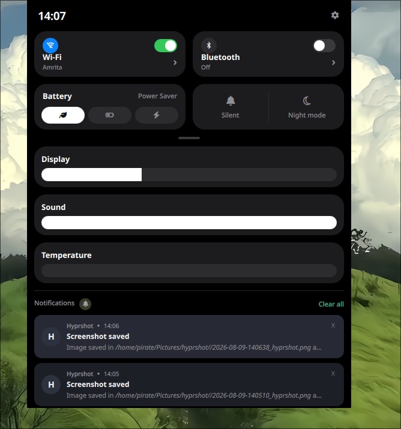
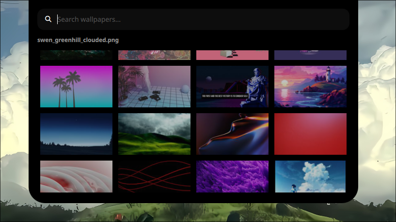
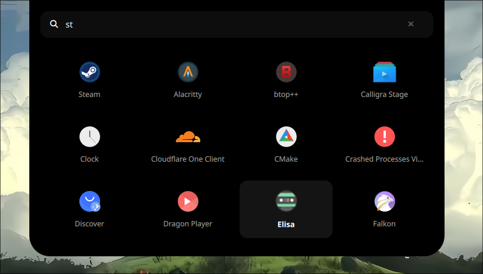
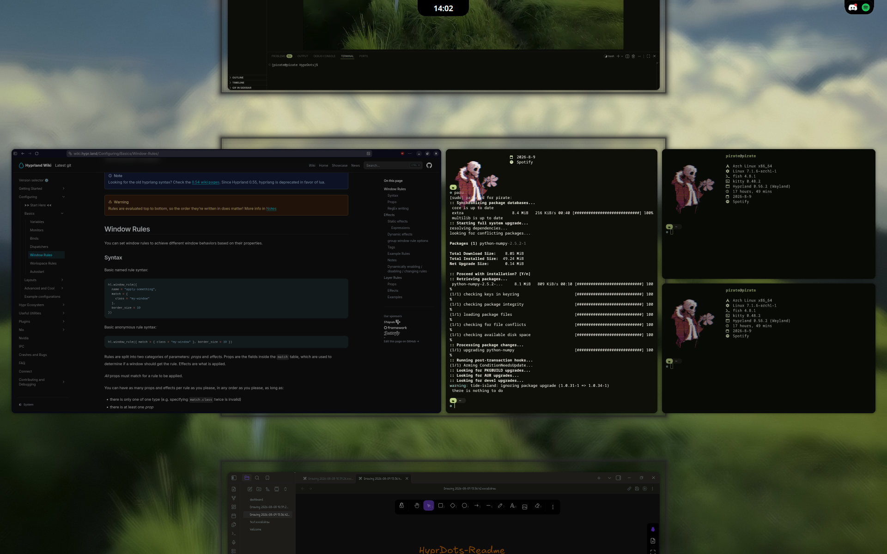
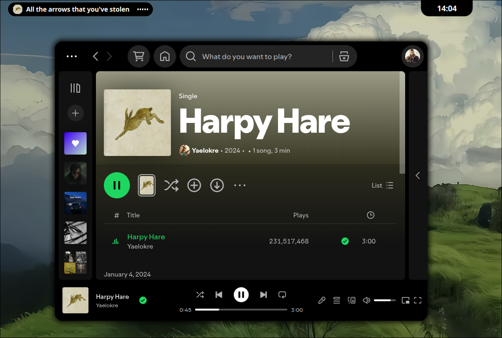
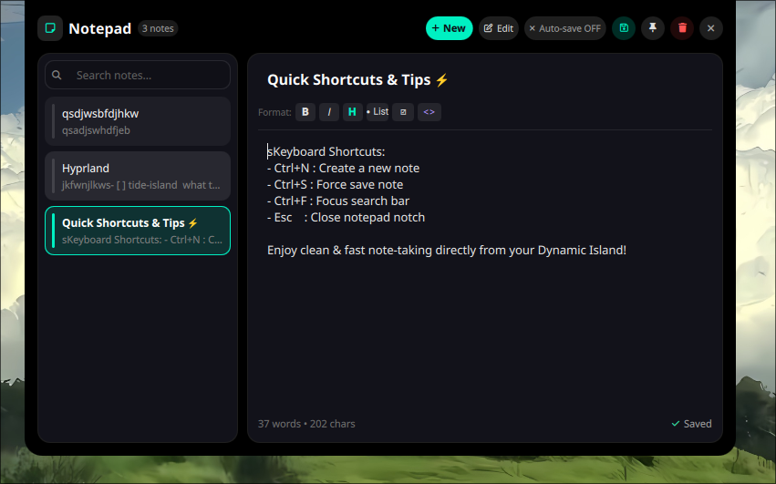
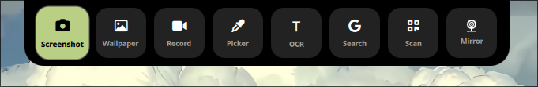
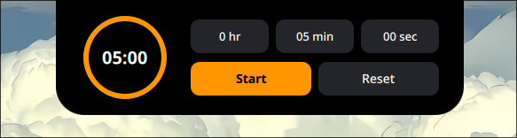
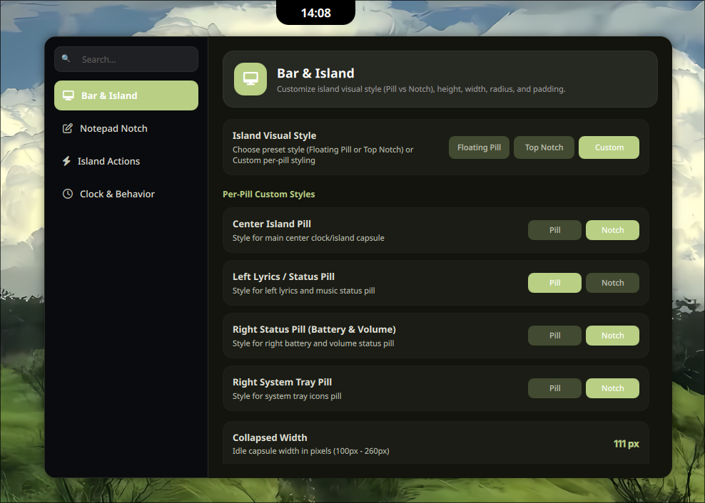

<div align="center">

# Pirate's Dots

Personal Hyprland dotfiles configured with Lua (`hyprlua`), Material You dynamic colors (`matugen`), and a custom Quickshell dynamic island desktop shell (`tide-island`).


</div>

---

## Overview

This repository contains my personal desktop configuration for Arch Linux. It blends Hyprland's Wayland compositor with Lua-based configuration management, automatically matched color schemes, and a custom interactive widget shell.

- **Dynamic Color Palettes**: Matugen extracts colors from your active wallpaper and generates matching themes across system apps.
- **Tide Island Shell**: A custom Quickshell / QML widget layer providing quick settings, media controls, notes, and status indicators.
- **Lua Configuration**: Modular Hyprland configuration handled via `hyprlua`.
- **Niri-Style Scrolling**: Fluid column resizing and workspace navigation.

---

## Screenshots

<div align="center">

### Control Center & Wallpaper Selection
| Control Center | Wallpaper Selector |
| :---: | :---: |
|  |  |

### Launcher & Workspace Overview
| App Launcher | Overview |
| :---: | :---: |
|  |  |

### Widgets & Notes
| Live Lyrics | Notepad |
| :---: | :---: |
|  |  |

### System Tools & Timer
| Utilities | Timer | Settings |
| :---: | :---: | :---: |
|  |  |  |

</div>

---

## Shortcuts

| Keybinding | Action |
| :--- | :--- |
| `Super` + `Enter` | Open Terminal (`kitty`) |
| `Super` + `D` | Toggle App Launcher |
| `Super` + `A` | Toggle Control Center |
| `Super` + `N` | Toggle Quick Notepad |
| `Super` + `U` | Toggle Utilities |
| `Super` + `Alt` + `W` | Open Wallpaper Selector |
| `Super` + `Tab` | Toggle Workspace Overview |
| `Super` + `F` | Fullscreen Window |
| `Super` + `Shift` + `F` | Toggle Column Width Fit |
| `Super` + `/` | Keybinding Cheatsheet |

---

## Quick Start

The included script handles installing missing packages, linking configuration folders, setting up cursors, and configuring system integration.

```bash
git clone https://github.com/BharathBala21/HyprDots.git
cd HyprDots
chmod +x install.sh
./install.sh
```
